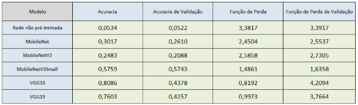

<h1 align="center">
  Comparative Network Neural Algorithms 
</h1>

Comparative Study of Network-Based Image Recognition Algorithms for Crop Analysis

## Database  
Database repository: [[https://rubygems.org/gems/gosu/versions/0.10.8](https://www.kaggle.com/datasets/mdwaquarazam/agricultural-crops-image-classification))

## Motivation  

The field of crop research is universally recognized for its critical importance in maximizing food production while minimizing seed loss. Leveraging artificial intelligence algorithms represents the next step in achieving this goal.

## results 

columns of graph > the model, accuracy, validation accuracy, loss, loss validation

  

  
This study provides valuable insights into CNN model selection and emphasizes the importance of regularization techniques and cross-validation to ensure robust results and effective generalization in image classification tasks. Based on the presented results, an evident limitation is the difference between training accuracy and validation accuracy in some models, such as VGG16 and VGG19. Additionally, MobileNet, although having a more balanced accuracy compared to others, still exhibits a significant gap between training and validation metrics. This suggests that this dataset with transfer learning on the MobileNet algorithm may not be ideal in terms of generalization.

